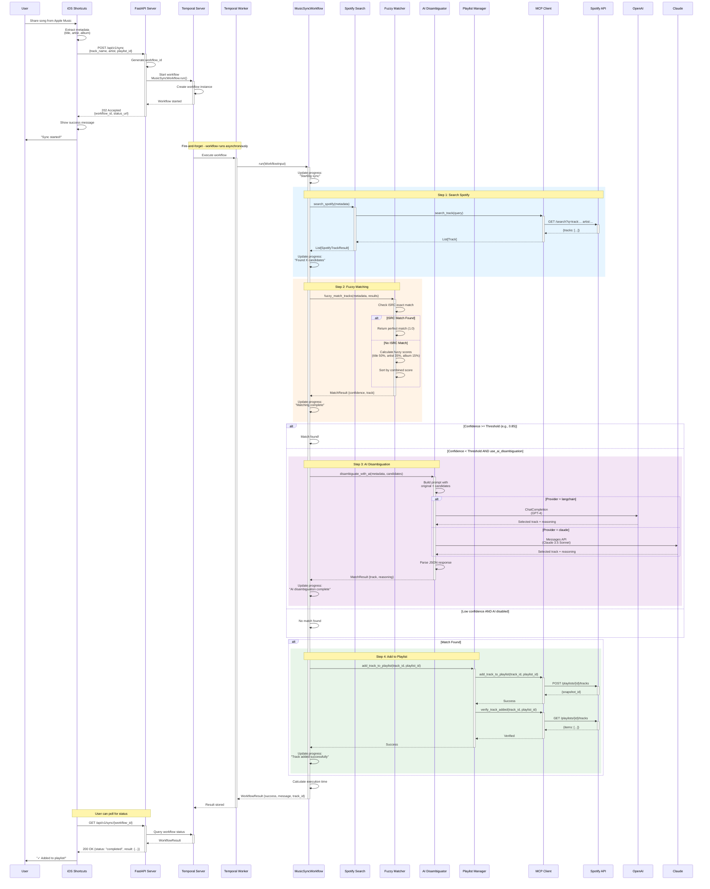
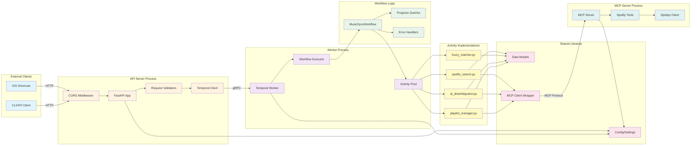

# Architecture Documentation

This document provides detailed architectural diagrams and explanations of the Spotify MCP Integration system.

## Table of Contents

1. [System Architecture](#system-architecture)
2. [Sync Workflow Sequence](#sync-workflow-sequence)
3. [Component Interactions](#component-interactions)
4. [Data Flow](#data-flow)
5. [Activity Execution Flow](#activity-execution-flow)
6. [Deployment Architecture](#deployment-architecture)

---

## System Architecture

High-level overview of the system components and their relationships.

```mermaid
graph TB
    subgraph "Client Layer"
        iOS[iOS Shortcuts App]
        User[User]
    end

    subgraph "API Layer"
        FastAPI[FastAPI Server<br/>Port 8000]
        Health[/api/v1/health]
        Sync[/api/v1/sync]
        Status[/api/v1/sync/:id]
        Cancel[/api/v1/sync/:id/cancel]
    end

    subgraph "Workflow Orchestration"
        Temporal[Temporal Server<br/>Port 7233]
        Worker[Temporal Worker]
        Workflow[MusicSyncWorkflow]
    end

    subgraph "Activities"
        Search[Spotify Search Activity]
        Fuzzy[Fuzzy Matcher Activity]
        AI[AI Disambiguator Activity]
        Playlist[Playlist Manager Activity]
    end

    subgraph "Integration Layer"
        MCP[MCP Client]
        MCPServer[MCP Spotify Server]
    end

    subgraph "External Services"
        SpotifyAPI[Spotify Web API]
        OpenAI[OpenAI API / GPT-4]
        Claude[Anthropic Claude API]
    end

    subgraph "Data Storage"
        PostgreSQL[(PostgreSQL<br/>Temporal DB)]
    end

    User -->|Share Song| iOS
    iOS -->|HTTP POST| FastAPI
    FastAPI -->|Start Workflow| Temporal
    Temporal -->|Execute| Worker
    Worker -->|Run| Workflow

    Workflow -->|1. Search| Search
    Workflow -->|2. Match| Fuzzy
    Workflow -->|3. Disambiguate| AI
    Workflow -->|4. Add to Playlist| Playlist

    Search -->|Call Tool| MCP
    AI -->|Call Tool| MCP
    Playlist -->|Call Tool| MCP

    MCP -->|MCP Protocol| MCPServer
    MCPServer -->|HTTPS| SpotifyAPI

    AI -.->|Provider: langchain| OpenAI
    AI -.->|Provider: claude| Claude

    Temporal -->|Store State| PostgreSQL

    FastAPI -.->|Query Progress| Temporal
    iOS -.->|Poll Status| Status

    classDef client fill:#e1f5ff,stroke:#01579b
    classDef api fill:#fff3e0,stroke:#e65100
    classDef workflow fill:#f3e5f5,stroke:#4a148c
    classDef activity fill:#e8f5e9,stroke:#1b5e20
    classDef integration fill:#fff9c4,stroke:#f57f17
    classDef external fill:#fce4ec,stroke:#880e4f
    classDef storage fill:#e0f2f1,stroke:#004d40

    class iOS,User client
    class FastAPI,Health,Sync,Status,Cancel api
    class Temporal,Worker,Workflow workflow
    class Search,Fuzzy,AI,Playlist activity
    class MCP,MCPServer integration
    class SpotifyAPI,OpenAI,Claude external
    class PostgreSQL storage
```

---

## Sync Workflow Sequence

Detailed sequence diagram showing the complete flow of a song sync request.



---

## Component Interactions

How different components interact with each other.



---

## Data Flow

How data flows through the system from request to completion.

```mermaid
flowchart TD
    Start([User shares song from Apple Music]) --> Extract[Extract song metadata]
    Extract --> Request{Create sync request}

    Request -->|track_name, artist, album, playlist_id| Validate[Validate request]

    Validate -->|Valid| GenerateID[Generate unique workflow_id]
    Validate -->|Invalid| Error1[Return 422 Validation Error]

    GenerateID --> CreateInput[Create WorkflowInput]
    CreateInput --> StartWF[Start Temporal Workflow]

    StartWF --> Return[Return 202 Accepted]
    Return --> EndUser([User sees: 'Sync started!'])

    StartWF --> WFStart[Workflow begins execution]

    WFStart --> SearchSpotify[Search Spotify via MCP]
    SearchSpotify --> Results{Found tracks?}

    Results -->|Yes| ParseResults[Parse to SpotifyTrackResult list]
    Results -->|No| NoMatch[Return: No matches found]

    ParseResults --> FuzzyMatch[Fuzzy matching algorithm]

    FuzzyMatch --> CheckISRC{ISRC available?}
    CheckISRC -->|Yes, matches| PerfectMatch[Perfect match - Score: 1.0]
    CheckISRC -->|No/Different| CalculateScore[Calculate weighted score<br/>Title: 50%, Artist: 35%, Album: 15%]

    CalculateScore --> BestScore[Select highest scoring track]
    PerfectMatch --> BestScore

    BestScore --> ThresholdCheck{Score >= threshold?}

    ThresholdCheck -->|Yes| MatchFound[Match found!]
    ThresholdCheck -->|No| AICheck{AI enabled?}

    AICheck -->|Yes| AIDisambiguate[AI Disambiguator]
    AICheck -->|No| NoMatch

    AIDisambiguate --> ProviderCheck{AI Provider?}

    ProviderCheck -->|langchain| CallOpenAI[Call OpenAI GPT-4]
    ProviderCheck -->|claude| CallClaude[Call Anthropic Claude]

    CallOpenAI --> ParseAI[Parse AI response]
    CallClaude --> ParseAI

    ParseAI --> AIResult{AI selected track?}
    AIResult -->|Yes| MatchFound
    AIResult -->|No| NoMatch

    MatchFound --> AddToPlaylist[Add track to Spotify playlist]

    AddToPlaylist --> Verify[Verify track was added]
    Verify --> VerifyResult{Verified?}

    VerifyResult -->|Yes| Success[Return success result]
    VerifyResult -->|No| Retry{Retry count < max?}

    Retry -->|Yes| AddToPlaylist
    Retry -->|No| Failure[Return failure result]

    Success --> StoreResult[(Store in Temporal)]
    Failure --> StoreResult
    NoMatch --> StoreResult

    StoreResult --> Complete([Workflow complete])

    Complete -.-> Poll[User polls status endpoint]
    Poll --> ReturnStatus[Return workflow status & result]
    ReturnStatus --> ShowUser([User sees: 'Added to playlist!'])

    style Start fill:#e1f5ff
    style EndUser fill:#c8e6c9
    style ShowUser fill:#c8e6c9
    style Error1 fill:#ffcdd2
    style NoMatch fill:#ffe0b2
    style Failure fill:#ffcdd2
    style Success fill:#c8e6c9
    style Complete fill:#e1f5ff
```



---

## Activity Execution Flow

Detailed flow of how activities are executed within the Temporal workflow.


---

## Deployment Architecture

Production deployment setup with Docker containers.


---

## Technology Stack Summary

| Layer | Technology | Purpose |
|-------|-----------|---------|
| **Client** | iOS Shortcuts | User interface for syncing |
| **API** | FastAPI | REST API endpoints |
| **Orchestration** | Temporal | Durable workflow execution |
| **Integration** | MCP (Model Context Protocol) | Spotify API wrapper |
| **AI** | OpenAI GPT-4 / Anthropic Claude | Track disambiguation |
| **Matching** | RapidFuzz | Fuzzy string matching |
| **Database** | PostgreSQL | Temporal workflow state |
| **HTTP Client** | HTTPX | Async HTTP requests |
| **Spotify Client** | Spotipy | Spotify API SDK |

---

## Key Design Decisions

### 1. Fire-and-Forget Architecture
- **Why**: Instant response to iOS users, no waiting for completion
- **How**: Temporal workflows run asynchronously after API returns 202 Accepted
- **Benefit**: Better UX, resilient to network issues

### 2. Temporal for Orchestration
- **Why**: Need durable, reliable workflow execution with retries
- **How**: Workflows persist state, survive worker restarts
- **Benefit**: Automatic retries, progress tracking, failure recovery

### 3. MCP for Spotify Integration
- **Why**: Standardized protocol for API tool calling
- **How**: MCP server exposes Spotify operations as callable tools
- **Benefit**: Clean separation, easy to mock/test, swappable implementations

### 4. Swappable AI Providers
- **Why**: Not all users have access to same AI services
- **How**: Abstract AI interface with multiple implementations
- **Benefit**: Flexibility, cost optimization, fallback options

### 5. ISRC Priority Matching
- **Why**: Most accurate way to match tracks across services
- **How**: Check ISRC first, fall back to fuzzy matching
- **Benefit**: Higher accuracy, fewer false positives

---

## Related Documentation

- [SETUP.md](./SETUP.md) - Local development setup
- [TESTING.md](./TESTING.md) - Testing guide
- [README.md](./README.md) - Project overview and quick start
- [docs/ios-shortcuts-setup.md](./docs/ios-shortcuts-setup.md) - iOS integration guide
