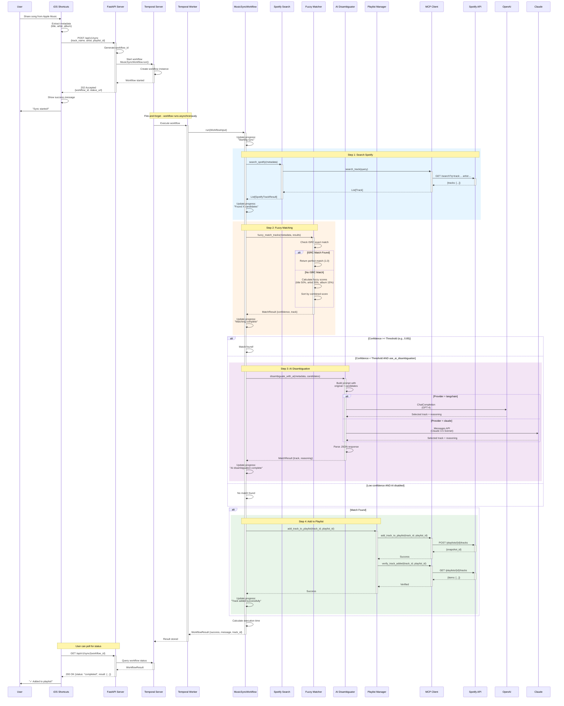
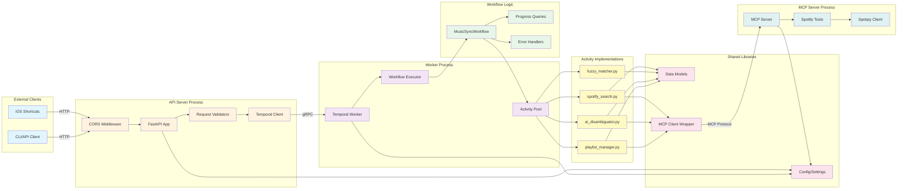
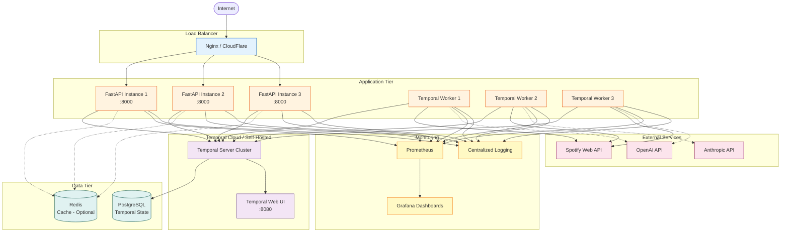
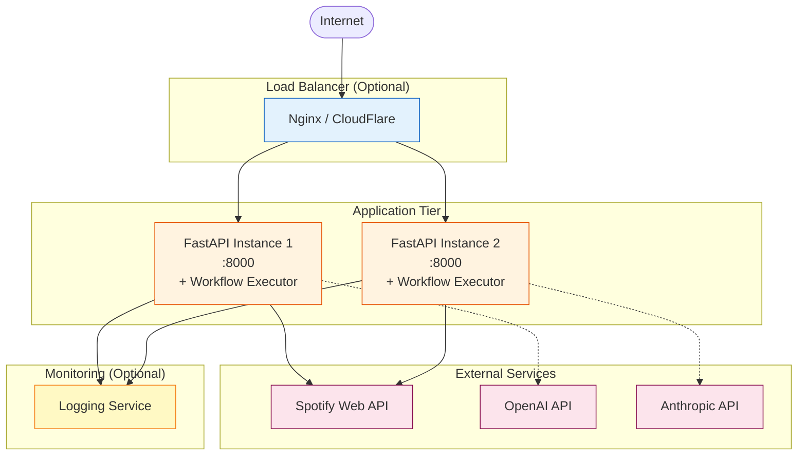

# Architecture Documentation

This document provides detailed architectural diagrams and explanations of the Spotify MCP Integration system.

## Table of Contents

1. [Execution Modes Overview](#execution-modes-overview)
2. [System Architecture (Temporal Mode)](#system-architecture-temporal-mode)
3. [System Architecture (Standalone Mode)](#system-architecture-standalone-mode)
4. [Sync Workflow Sequence](#sync-workflow-sequence)
5. [Component Interactions](#component-interactions)
6. [Data Flow](#data-flow)
7. [Activity Execution Flow](#activity-execution-flow)
8. [Deployment Architecture](#deployment-architecture)

---

## Execution Modes Overview

The system supports **two execution modes** controlled by the `USE_TEMPORAL` environment variable:

### 🏢 Temporal Mode (`USE_TEMPORAL=true`)

**Architecture**: Distributed, durable workflow orchestration
**Best for**: Production, high reliability, distributed processing

**Key Components**:
- Temporal Server (workflow orchestration engine)
- PostgreSQL (state persistence)
- Temporal Worker (executes workflows & activities)
- FastAPI Server (HTTP endpoints)
- MCP Client/Server (Spotify integration)

**Features**:
- ✅ Durable execution (survives server restarts)
- ✅ Advanced retry policies with exponential backoff
- ✅ Distributed processing across multiple workers
- ✅ Real-time progress tracking via queries
- ✅ Complete workflow history and replay
- ✅ Automatic state management

### ⚡ Standalone Mode (`USE_TEMPORAL=false`)

**Architecture**: Direct, synchronous execution
**Best for**: Development, testing, simple deployments

**Key Components**:
- FastAPI Server (HTTP endpoints + workflow execution)
- MCP Client/Server (Spotify integration)
- In-memory state storage

**Features**:
- ✅ Simple deployment (no infrastructure)
- ✅ Lower resource usage
- ✅ Faster startup time
- ✅ Identical API endpoints
- ⚠️ In-memory state only (lost on restart)
- ⚠️ Basic retry logic
- ⚠️ Single-server execution

**📖 For detailed comparison, see [docs/EXECUTION_MODES.md](./docs/EXECUTION_MODES.md)**

---

## System Architecture (Temporal Mode)

High-level overview when `USE_TEMPORAL=true` (production mode).

```mermaid
graph TB
    subgraph "Client Layer"
        iOS[iOS Shortcuts App]
        User[User]
    end

    subgraph "API Layer"
        FastAPI[FastAPI Server<br/>Port 8000]
        Health[/api/v1/health]
        Sync[/api/v1/sync]
        Status[/api/v1/sync/:id]
        Cancel[/api/v1/sync/:id/cancel]
    end

    subgraph "Workflow Orchestration"
        Temporal[Temporal Server<br/>Port 7233]
        Worker[Temporal Worker]
        Workflow[MusicSyncWorkflow]
    end

    subgraph "Activities"
        Search[Spotify Search Activity]
        Fuzzy[Fuzzy Matcher Activity]
        AI[AI Disambiguator Activity]
        Playlist[Playlist Manager Activity]
    end

    subgraph "Integration Layer"
        MCP[MCP Client]
        MCPServer[MCP Spotify Server]
    end

    subgraph "External Services"
        SpotifyAPI[Spotify Web API]
        OpenAI[OpenAI API / GPT-4]
        Claude[Anthropic Claude API]
    end

    subgraph "Data Storage"
        PostgreSQL[(PostgreSQL<br/>Temporal DB)]
    end

    User -->|Share Song| iOS
    iOS -->|HTTP POST| FastAPI
    FastAPI -->|Start Workflow| Temporal
    Temporal -->|Execute| Worker
    Worker -->|Run| Workflow

    Workflow -->|1. Search| Search
    Workflow -->|2. Match| Fuzzy
    Workflow -->|3. Disambiguate| AI
    Workflow -->|4. Add to Playlist| Playlist

    Search -->|Call Tool| MCP
    AI -->|Call Tool| MCP
    Playlist -->|Call Tool| MCP

    MCP -->|MCP Protocol| MCPServer
    MCPServer -->|HTTPS| SpotifyAPI

    AI -.->|Provider: langchain| OpenAI
    AI -.->|Provider: claude| Claude

    Temporal -->|Store State| PostgreSQL

    FastAPI -.->|Query Progress| Temporal
    iOS -.->|Poll Status| Status

    classDef client fill:#e1f5ff,stroke:#01579b
    classDef api fill:#fff3e0,stroke:#e65100
    classDef workflow fill:#f3e5f5,stroke:#4a148c
    classDef activity fill:#e8f5e9,stroke:#1b5e20
    classDef integration fill:#fff9c4,stroke:#f57f17
    classDef external fill:#fce4ec,stroke:#880e4f
    classDef storage fill:#e0f2f1,stroke:#004d40

    class iOS,User client
    class FastAPI,Health,Sync,Status,Cancel api
    class Temporal,Worker,Workflow workflow
    class Search,Fuzzy,AI,Playlist activity
    class MCP,MCPServer integration
    class SpotifyAPI,OpenAI,Claude external
    class PostgreSQL storage
```

---

## System Architecture (Standalone Mode)

Simplified architecture when `USE_TEMPORAL=false` (development/simple deployments).

```mermaid
graph TB
    subgraph "Client Layer"
        iOS[iOS Shortcuts App]
        User[User]
    end

    subgraph "API Layer"
        FastAPI[FastAPI Server<br/>Port 8000<br/>+ Workflow Executor]
        Health[/api/v1/health]
        Sync[/api/v1/sync]
        Status[/api/v1/sync/:id]
    end

    subgraph "Execution Layer"
        Executor[Standalone Executor<br/>In-Memory State]
        Search[Search Function]
        Fuzzy[Fuzzy Match Function]
        AI[AI Disambiguate Function]
        Playlist[Playlist Function]
    end

    subgraph "Integration Layer"
        MCP[MCP Client]
        MCPServer[MCP Spotify Server]
    end

    subgraph "External Services"
        SpotifyAPI[Spotify Web API]
        OpenAI[OpenAI API / GPT-4]
        Claude[Anthropic Claude API]
    end

    User -->|Share Song| iOS
    iOS -->|HTTP POST| FastAPI
    FastAPI -->|Execute Directly| Executor

    Executor -->|1. Search| Search
    Executor -->|2. Match| Fuzzy
    Executor -->|3. Disambiguate| AI
    Executor -->|4. Add to Playlist| Playlist

    Search -->|Call Tool| MCP
    AI -->|Call Tool| MCP
    Playlist -->|Call Tool| MCP

    MCP -->|MCP Protocol| MCPServer
    MCPServer -->|HTTPS| SpotifyAPI

    AI -.->|Provider: langchain| OpenAI
    AI -.->|Provider: claude| Claude

    iOS -.->|Poll Status| Status
    FastAPI -.->|Query State| Executor

    classDef client fill:#e1f5ff,stroke:#01579b
    classDef api fill:#fff3e0,stroke:#e65100
    classDef executor fill:#e8f5e9,stroke:#1b5e20
    classDef integration fill:#fff9c4,stroke:#f57f17
    classDef external fill:#fce4ec,stroke:#880e4f

    class iOS,User client
    class FastAPI,Health,Sync,Status api
    class Executor,Search,Fuzzy,AI,Playlist executor
    class MCP,MCPServer integration
    class SpotifyAPI,OpenAI,Claude external
```

**Key Differences from Temporal Mode:**
- ❌ No Temporal Server (no workflow orchestration)
- ❌ No PostgreSQL (no persistent state storage)
- ❌ No Worker process (execution happens in FastAPI)
- ✅ Simpler deployment (2 components vs 5+)
- ✅ Lower resource usage
- ⚠️ State stored in-memory (lost on restart)

---

## Sync Workflow Sequence

Detailed sequence diagram showing the complete flow of a song sync request (Temporal Mode).



---

## Component Interactions

How different components interact with each other.



---

## Data Flow

How data flows through the system from request to completion.


---

## Activity Execution Flow

Detailed flow of how activities are executed within the Temporal workflow.

```mermaid
stateDiagram-v2
    [*] --> WorkflowStarted: Workflow instance created

    WorkflowStarted --> SearchActivity: Execute search activity

    state SearchActivity {
        [*] --> BuildQuery: Build search query from metadata
        BuildQuery --> CallMCP: Call MCP search_track tool
        CallMCP --> MCPRequest: MCP makes Spotify API request
        MCPRequest --> ParseResponse: Parse Spotify response
        ParseResponse --> ReturnTracks: Return List[SpotifyTrackResult]
        ReturnTracks --> [*]

        state error_handling <<choice>>
        MCPRequest --> error_handling: On error
        error_handling --> RateLimit: 429 Rate Limit
        error_handling --> APIError: 4xx/5xx Error
        error_handling --> MCPError: MCP Tool Error

        RateLimit --> WaitRetry: Wait retry_after seconds
        WaitRetry --> CallMCP

        APIError --> Retry: Retry with backoff
        Retry --> CallMCP

        MCPError --> [*]: Non-retryable error
    }

    SearchActivity --> CheckResults: Activity complete

    CheckResults --> FuzzyMatchActivity: Has results
    CheckResults --> NoMatchState: No results

    state FuzzyMatchActivity {
        [*] --> IterateTracks: For each candidate
        IterateTracks --> CheckISRC: Check ISRC match

        state isrc_check <<choice>>
        CheckISRC --> isrc_check
        isrc_check --> ISRCMatch: ISRCs match
        isrc_check --> CalculateScores: No ISRC match

        ISRCMatch --> SetPerfectScore: Set score = 1.0

        CalculateScores --> TitleScore: fuzz.ratio(title) * 0.5
        TitleScore --> ArtistScore: fuzz.ratio(artist) * 0.35
        ArtistScore --> AlbumScore: fuzz.ratio(album) * 0.15
        AlbumScore --> CombinedScore: Sum weighted scores

        SetPerfectScore --> StoreScore
        CombinedScore --> StoreScore: Store FuzzyMatchScore

        StoreScore --> MoreTracks: More tracks?
        MoreTracks --> IterateTracks: Yes
        MoreTracks --> SelectBest: No

        SelectBest --> [*]: Return highest score
    }

    FuzzyMatchActivity --> EvaluateMatch: Activity complete

    state EvaluateMatch <<choice>>
    EvaluateMatch --> HighConfidence: Score >= threshold
    EvaluateMatch --> LowConfidence: Score < threshold

    HighConfidence --> AddToPlaylistActivity

    LowConfidence --> AIEnabledCheck: Check use_ai_disambiguation

    state AIEnabledCheck <<choice>>
    AIEnabledCheck --> AIActivity: Enabled
    AIEnabledCheck --> NoMatchState: Disabled

    state AIActivity {
        [*] --> BuildPrompt: Build disambiguation prompt
        BuildPrompt --> SelectProvider: Check AI_PROVIDER setting

        state provider_choice <<choice>>
        SelectProvider --> provider_choice
        provider_choice --> UseLangchain: Provider = langchain
        provider_choice --> UseClaude: Provider = claude

        UseLangchain --> CallOpenAI: OpenAI GPT-4 API
        UseClaude --> CallClaudeAPI: Anthropic Claude API

        CallOpenAI --> ParseJSON
        CallClaudeAPI --> ParseJSON: Parse JSON response

        ParseJSON --> ValidateResponse: Validate track selection
        ValidateResponse --> [*]: Return selected track
    }

    AIActivity --> AIResult: Activity complete

    state AIResult <<choice>>
    AIResult --> AddToPlaylistActivity: Track selected
    AIResult --> NoMatchState: No selection

    state AddToPlaylistActivity {
        [*] --> AddTrack: Call MCP add_track_to_playlist
        AddTrack --> WaitForAdd: Wait for Spotify response
        WaitForAdd --> VerifyAdd: Call verify_track_added
        VerifyAdd --> CheckPlaylist: Check playlist tracks

        state verify_check <<choice>>
        CheckPlaylist --> verify_check
        verify_check --> Verified: Track found in playlist
        verify_check --> NotVerified: Track not found

        NotVerified --> RetryAdd: Retry count < max
        RetryAdd --> AddTrack

        Verified --> [*]: Success
    }

    AddToPlaylistActivity --> SuccessState
    NoMatchState --> FailureState

    SuccessState --> CalculateMetrics: Calculate execution time
    FailureState --> CalculateMetrics

    CalculateMetrics --> ReturnResult: Create WorkflowResult
    ReturnResult --> [*]: Workflow complete

    note right of SearchActivity
        Retries: 3 attempts
        Timeout: 60s
        Backoff: Exponential
    end note

    note right of AIActivity
        Swappable providers:
        - Langchain (OpenAI)
        - Claude SDK (Anthropic)
    end note

    note right of AddToPlaylistActivity
        Includes verification
        to ensure track was
        actually added
    end note
```



---

## Deployment Architecture

### Temporal Mode Deployment (Production)

Production deployment setup with distributed Temporal infrastructure.



### Standalone Mode Deployment (Simplified)

Lightweight deployment without Temporal infrastructure.



**Deployment Mode Comparison:**

| Aspect | Temporal Mode | Standalone Mode |
|--------|---------------|-----------------|
| **Components** | 7+ (API, Worker, Temporal, PostgreSQL, etc.) | 1-2 (FastAPI only) |
| **Scaling** | Horizontal (multiple workers) | Horizontal (stateless API) |
| **State Storage** | PostgreSQL (persistent) | In-memory (ephemeral) |
| **Cost** | Higher ($200-400/month) | Lower ($10-50/month) |
| **Complexity** | High (orchestration layer) | Low (direct execution) |
| **Reliability** | High (durable workflows) | Medium (best-effort) |
| **Best For** | Production, high traffic | Development, low traffic |

---

## Technology Stack Summary

| Layer | Technology | Purpose | Required In |
|-------|-----------|---------|-------------|
| **Client** | iOS Shortcuts | User interface for syncing | Both modes |
| **API** | FastAPI | REST API endpoints | Both modes |
| **Orchestration** | Temporal | Durable workflow execution | Temporal mode only |
| **Executor** | Standalone Executor | Direct workflow execution | Standalone mode only |
| **Integration** | MCP (Model Context Protocol) | Spotify API wrapper | Both modes |
| **AI** | OpenAI GPT-4 / Anthropic Claude | Track disambiguation | Both modes |
| **Matching** | RapidFuzz | Fuzzy string matching | Both modes |
| **Database** | PostgreSQL | Temporal workflow state | Temporal mode only |
| **HTTP Client** | HTTPX | Async HTTP requests | Both modes |
| **Spotify Client** | Spotipy | Spotify API SDK | Both modes |

---

## Key Design Decisions

### 1. Dual Execution Modes
- **Why**: Different deployment scenarios have different requirements
- **How**: `USE_TEMPORAL` flag toggles between Temporal orchestration and direct execution
- **Benefit**: Simple deployments don't need complex infrastructure, but can scale up when needed
- **Trade-off**: In standalone mode, lose durability and advanced retry capabilities

### 2. Fire-and-Forget Architecture
- **Why**: Instant response to iOS users, no waiting for completion
- **How**: Workflows run asynchronously after API returns 202 Accepted
- **Benefit**: Better UX, resilient to network issues
- **Implementation**: Temporal workflows (temporal mode) or asyncio tasks (standalone mode)

### 3. Temporal for Orchestration (Optional)
- **Why**: Need durable, reliable workflow execution with retries for production
- **How**: Workflows persist state, survive worker restarts
- **Benefit**: Automatic retries, progress tracking, failure recovery
- **When**: Enable with `USE_TEMPORAL=true` for production deployments

### 4. Standalone Executor (Alternative)
- **Why**: Not all deployments need Temporal's complexity
- **How**: Direct async execution with in-memory state and basic retry logic
- **Benefit**: Simple deployment, lower resource usage, faster development
- **When**: Enable with `USE_TEMPORAL=false` for development or simple deployments

### 5. MCP for Spotify Integration
- **Why**: Standardized protocol for API tool calling
- **How**: MCP server exposes Spotify operations as callable tools
- **Benefit**: Clean separation, easy to mock/test, swappable implementations
- **Note**: Works identically in both execution modes

### 6. Swappable AI Providers
- **Why**: Not all users have access to same AI services
- **How**: Abstract AI interface with multiple implementations (Langchain/OpenAI or Claude SDK)
- **Benefit**: Flexibility, cost optimization, fallback options
- **Note**: Both providers work in both execution modes

### 7. ISRC Priority Matching
- **Why**: Most accurate way to match tracks across services
- **How**: Check ISRC first, fall back to fuzzy matching
- **Benefit**: Higher accuracy, fewer false positives
- **Note**: Same matching logic in both execution modes

---

## Related Documentation

- [README.md](./README.md) - Project overview and quick start
- [docs/EXECUTION_MODES.md](./docs/EXECUTION_MODES.md) - **Detailed comparison of Temporal vs Standalone modes**
- [SETUP.md](./SETUP.md) - Local development setup (both modes)
- [TESTING.md](./TESTING.md) - Testing guide
- [docs/ios-shortcuts-setup.md](./docs/ios-shortcuts-setup.md) - iOS integration guide
