# Apple Music to Spotify Sync 🎵

Seamlessly sync songs from Apple Music to Spotify playlists using iOS Shortcuts. This system uses **Anthropic's Agent SDK** with MCP (Model Context Protocol) for intelligent, AI-powered music synchronization.

> **🚀 Now Using Agent SDK:** This project has migrated to Anthropic's Agent SDK as the primary implementation. The Agent SDK provides built-in AI reasoning, automatic tool orchestration, and simpler code compared to previous Temporal or Standalone approaches. See [AGENT_INTEGRATION.md](./AGENT_INTEGRATION.md) for details.

## Demo


Watch the one-tap sync in action: Share a song from Apple Music → Tap "Add to Spotify" → Done! The AI intelligently matches and adds it to your Spotify playlist.

## Why This Project Exists

### The Problem: Apple Music Deletes Your Library When You Unsubscribe

After 6 years on Apple Music, I switched to Spotify—only to discover that **Apple Music deletes your entire music library after a certain period when you unsubscribe** ([see this Reddit discussion](https://www.reddit.com/r/AppleMusic/comments/1lrui17/psa_if_you_decide_to_unsubscribe_from_apple_music/)). Unlike Spotify, which preserves your library even without an active subscription, Apple wipes everything.

**Here's what happened:**
- 📚 **6 years of curated music** - Gone after unsubscribing from Apple Music
- 🎵 **Apple's recommendation engine still knows my taste** - It has all my listening history
- 📱 **Got a new phone with 3 months of free Apple Music** - Still shows great recommendations based on my old data
- 😫 **The frustration** - No easy way to save those recommended gems to my Spotify playlists

### The Solution: One-Tap Sync from Apple Music to Spotify

This project bridges that gap. When Apple Music recommends a song I want to keep, I can now:
1. Tap the **Share** button in Apple Music
2. Select **"Add to Spotify"** shortcut
3. Done! The song is intelligently matched and added to my Spotify playlist

**No more:**
- ❌ Manual searching on Spotify
- ❌ Losing track of great recommendations
- ❌ Switching between apps to find the same song
- ❌ Worrying about losing my music library again

This is especially valuable for anyone who:
- Switched from Apple Music to Spotify
- Lost their library due to Apple's deletion policy
- Still uses Apple Music's recommendation engine
- Wants a seamless way to preserve discoveries across platforms

## Features

- **One-tap syncing** from Apple Music share sheet via iOS Shortcuts
- **AI-powered matching** with Claude's built-in reasoning (99% confidence)
- **Automatic disambiguation** of remasters, live versions, and covers
- **Fire-and-forget** architecture for instant response
- **MCP-based tool execution** for clean Spotify API integration
- **Prompt-based customization** - change behavior without code changes
- **Simple deployment** - no Docker or workflow orchestration required
- **Fast API responses** with background processing
- **ISRC matching** for exact track identification when available

## Architecture

### Current: Agent SDK Architecture (Recommended)

```mermaid
graph LR
    A[📱 iOS Shortcuts] -->|HTTP POST| B[🚀 FastAPI Server]
    B -->|Background Task| C[🤖 Agent Executor]
    C -->|Agent SDK| D[🧠 Claude]
    C -->|MCP Protocol| E[🎵 MCP Spotify Server]
    E -->|REST API| F[🎶 Spotify API]
    D -.->|Built-in AI Reasoning| C

    style A fill:#e1f5ff,stroke:#01579b,stroke-width:2px
    style B fill:#fff3e0,stroke:#e65100,stroke-width:2px
    style C fill:#f3e5f5,stroke:#4a148c,stroke-width:2px
    style D fill:#e8f5e9,stroke:#1b5e20,stroke-width:2px
    style E fill:#fce4ec,stroke:#880e4f,stroke-width:2px
    style F fill:#e0f2f1,stroke:#004d40,stroke-width:2px
```



**How it works:**
1. iOS Shortcut sends track info to FastAPI server
2. Server spawns background task with Agent Executor
3. Agent SDK connects to MCP Spotify Server
4. Claude automatically selects and executes MCP tools:
   - `search_track` - Find candidates on Spotify
   - `add_track_to_playlist` - Add best match
   - `verify_track_added` - Confirm success
5. Claude's built-in reasoning handles disambiguation
6. Server returns result with 99% confidence match

**📖 Documentation:**
- **[AGENT_INTEGRATION.md](./AGENT_INTEGRATION.md)** - Complete Agent SDK guide (⭐ **START HERE**)
- **[ARCHITECTURE.md](./ARCHITECTURE.md)** - Detailed architecture diagrams
- **[MIGRATION_GUIDE.md](./MIGRATION_GUIDE.md)** - Migration from old architectures
- **[PROJECT_STRUCTURE.md](./PROJECT_STRUCTURE.md)** - File organization guide

### Components

- **📱 iOS Shortcuts** - User interface for one-tap syncing from Apple Music
- **🚀 FastAPI Server** (`api/app_agent.py`) - HTTP endpoints for sync requests
- **🤖 Agent Executor** (`agent_executor.py`) - Orchestrates Agent SDK
- **🧠 Claude** - Built-in AI reasoning and tool selection (via Agent SDK)
- **🎵 MCP Server** (`mcp_server/spotify_server.py`) - Spotify API tools
- **🎶 Spotify API** - Music streaming service backend

### Legacy Architectures (Deprecated)

> **⚠️ Note:** Temporal and Standalone executors are deprecated. See [MIGRATION_GUIDE.md](./MIGRATION_GUIDE.md) for migration details.

**Previous implementations:**
- **Temporal Workflows** - Required Docker, complex setup (moved to `_deprecated/`)
- **Standalone Executor** - Separate Claude API calls (moved to `_deprecated/`)

## Why Agent SDK?

The project has evolved through multiple architectures to arrive at the current Agent SDK implementation:

| Aspect | Agent SDK (Current) | Temporal (Deprecated) | Standalone (Deprecated) |
|--------|---------------------|----------------------|-------------------------|
| **Setup Complexity** | ✅ Low | ❌ Very High | ⚠️ Medium |
| **Code Lines** | ✅ ~150 | ❌ ~500 | ⚠️ ~300 |
| **Dependencies** | ✅ Agent SDK only | ❌ Docker + Temporal | ⚠️ Many libraries |
| **AI Integration** | ✅ Built-in | ❌ Separate activity | ❌ Manual API calls |
| **Match Quality** | ✅ 99% confidence | ⚠️ ~80% | ⚠️ ~80% |
| **Performance** | ⚠️ ~22s | ✅ 10-15s | ✅ 8-12s |
| **Maintainability** | ✅ Prompt-based | ❌ Complex code | ⚠️ Manual logic |
| **Recommended** | ✅ **YES** | ❌ No | ❌ No |

**Performance vs Intelligence Trade-off:**
- Agent SDK is slower (~22s) but produces significantly better matches (99% vs ~80% confidence)
- For fire-and-forget iOS Shortcuts use case, the extra 10 seconds is acceptable
- See [PERFORMANCE_TEST_RESULTS.md](./PERFORMANCE_TEST_RESULTS.md) for detailed analysis
- See [MIGRATION_GUIDE.md](./MIGRATION_GUIDE.md) for architecture comparison

## Quick Start

### Prerequisites

**Core Requirements:**
- Python 3.11+
- [UV](https://docs.astral.sh/uv/) (recommended) or pip for package management
- Spotify Developer Account ([Get credentials](https://developer.spotify.com/dashboard))
- **Anthropic API Key** (required for Agent SDK) - [Get key](https://console.anthropic.com/settings/keys)
- iPhone with iOS Shortcuts app (optional, for iOS integration)

**Installing UV (recommended):**
```bash
# On macOS/Linux
curl -LsSf https://astral.sh/uv/install.sh | sh

# On Windows
powershell -c "irm https://astral.sh/uv/install.ps1 | iex"
```

### 1. Clone and Install

This project uses [UV](https://docs.astral.sh/uv/) for fast, reliable Python package management.

```bash
cd spotify-mcp-integration

# Install dependencies with UV
uv sync

# Activate the virtual environment
source .venv/bin/activate  # On Windows: .venv\Scripts\activate
```

**Alternative (using pip):**
```bash
python -m venv venv
source venv/bin/activate  # On Windows: venv\Scripts\activate
pip install -r requirements.txt
```

### 2. Configure Environment

```bash
cp .env.example .env
```

Edit `.env` and add your credentials:

```env
# Anthropic API Key (REQUIRED for Agent SDK)
# Get from https://console.anthropic.com/settings/keys
ANTHROPIC_API_KEY=your_anthropic_key_here

# Spotify API (get from https://developer.spotify.com/dashboard)
SPOTIFY_CLIENT_ID=your_client_id_here
SPOTIFY_CLIENT_SECRET=your_client_secret_here
SPOTIFY_REDIRECT_URI=http://127.0.0.1:8888/callback

# Default Playlist ID (optional, can be provided per-request)
DEFAULT_PLAYLIST_ID=your_playlist_id_here
```

**Getting Spotify Credentials:**
1. Go to [Spotify Developer Dashboard](https://developer.spotify.com/dashboard)
2. Click **Create app**
3. Fill in app details (name, description, redirect URI)
4. **Add redirect URI:** `http://127.0.0.1:8888/callback`
   - ⚠️ **IMPORTANT:** Use `127.0.0.1`, NOT `localhost` (Spotify requirement)
   - Use HTTP (not HTTPS) for local development
5. Copy **Client ID** and **Client Secret**

**Getting Anthropic API Key:**
1. Go to [Anthropic Console](https://console.anthropic.com/settings/keys)
2. Create a new API key
3. Copy the key (starts with `sk-ant-...`)

**Getting Playlist ID:**
- Open Spotify → Right-click playlist → Share → Copy link
- Extract ID from URL: `spotify.com/playlist/37i9dQZF1DXcBWIGoYBM5M` → `37i9dQZF1DXcBWIGoYBM5M`

### 3. Authenticate with Spotify

First time only - run the MCP server to authenticate:

```bash
python mcp_server/spotify_server.py
```

This will:
1. Open a browser for Spotify OAuth
2. Ask you to log in and authorize the app
3. Create a `.cache-spotify` file with your auth token
4. Exit after successful auth (press Ctrl+C)

### 4. Start the API Server

Start the Agent SDK API server:

```bash
# Simple way (recommended)
./run.sh

# Or with UV
uv run uvicorn api.app_agent:app --host 0.0.0.0 --port 8000 --reload

# Or activate virtual environment first
source .venv/bin/activate
python -m uvicorn api.app_agent:app --host 0.0.0.0 --port 8000 --reload
```

You should see:
```
INFO:     Started server process [12345]
INFO:     Waiting for application startup.
INFO:     Application startup complete.
INFO:     Uvicorn running on http://0.0.0.0:8000
```

Access the API docs at: http://localhost:8000/docs

### 5. Test the API

```bash
curl -X POST http://localhost:8000/api/v1/sync \
  -H "Content-Type: application/json" \
  -d '{
    "track_name": "Bohemian Rhapsody",
    "artist": "Queen",
    "album": "A Night at the Opera",
    "playlist_id": "YOUR_PLAYLIST_ID"
  }'
```

Expected response:
```json
{
  "workflow_id": "sync-anonymous-1699564832-a3f9d",
  "status": "accepted",
  "message": "Sync started for 'Bohemian Rhapsody' by Queen",
  "status_url": "/api/v1/sync/sync-anonymous-1699564832-a3f9d"
}
```

Check status:
```bash
curl http://localhost:8000/api/v1/sync/sync-anonymous-1699564832-a3f9d
```

## iOS Shortcuts Setup

### 1. Get Your Server IP

On your Mac (same WiFi network):
```bash
ifconfig | grep "inet " | grep -v 127.0.0.1
```

Use the IP shown (e.g., `192.168.1.100`)

### 2. Create Shortcut

1. Open **Shortcuts** app on iPhone
2. Tap **+** to create new shortcut
3. Add these actions:

#### Actions:

1. **Receive** → Any Input from Share Sheet
   - Type: Music

2. **Get Details of Music**
   - Get: Name → Save as `trackName`

3. **Get Details of Music**
   - Get: Artist → Save as `artistName`

4. **Get Details of Music**
   - Get: Album Name → Save as `albumName`

5. **Dictionary**
   - Add keys:
     - `track_name`: trackName
     - `artist`: artistName
     - `album`: albumName
     - `playlist_id`: `YOUR_PLAYLIST_ID`

6. **Get Contents of URL**
   - URL: `http://YOUR_IP:8000/api/v1/sync`
   - Method: POST
   - Headers:
     - `Content-Type`: `application/json`
   - Request Body: JSON → Dictionary from previous step

7. **Show Notification** (Optional)
   - Title: "Added to Spotify"
   - Body: "Syncing trackName by artistName"

8. Name your shortcut: **"Add to Spotify"**

9. Enable **Show in Share Sheet**

### 3. Use the Shortcut

1. Play any song in Apple Music
2. Tap **Share** button
3. Select **Add to Spotify**
4. Done! Song syncs in the background

## Configuration

### AI Customization

The Agent SDK uses Claude for all AI reasoning. You can customize behavior by editing the system prompt in `agent_executor.py`:

```python
system_prompt = """
You are a music matching assistant. Search Spotify for the given track,
analyze all candidates, and add the best match to the playlist.
Return a structured JSON response with confidence score and reasoning.
"""
```

**Prompt changes allow you to:**
- Adjust matching strictness
- Prefer certain track versions (original vs remaster)
- Add custom business rules
- Change response format

No code changes needed - just update the prompt!

### Advanced Options

Optional environment variables:

```env
# MCP Server Configuration
MCP_SERVER_TIMEOUT=60  # Seconds to wait for MCP server startup

# Agent SDK Model
CLAUDE_MODEL=claude-sonnet-4-5  # Use latest Claude model

# Logging
LOG_LEVEL=INFO  # DEBUG, INFO, WARNING, ERROR
```

## Monitoring

### Health Check

```bash
curl http://localhost:8000/api/v1/health
```

Response:
```json
{
  "status": "healthy",
  "timestamp": "2025-11-17T10:30:00Z"
}
```

### API Logs

View detailed logs when running the server:

```bash
uv run uvicorn api.app_agent:app --log-level debug
```

Log levels:
- `debug` - Detailed debugging information
- `info` - General informational messages (default)
- `warning` - Warning messages only
- `error` - Error messages only

### Performance Metrics

See [PERFORMANCE_TEST_RESULTS.md](./PERFORMANCE_TEST_RESULTS.md) for:
- API response times
- Agent execution breakdown
- Performance optimization options

## Project Structure

```
spotify-mcp-integration/
├── api/                       # FastAPI server
│   ├── app_agent.py          ✅ Agent SDK API server (CURRENT)
│   ├── app.py                ⚠️ Temporal API (deprecated)
│   └── models.py             # Request/response models
├── agent_executor.py         ✅ Agent SDK executor (CURRENT)
├── mcp_server/               # MCP Spotify server
│   └── spotify_server.py     ✅ Spotify MCP tools (CURRENT)
├── mcp_client/               # MCP client library
│   └── client.py             # Custom MCP client (for testing)
├── models/                   # Data models
│   └── data_models.py        # Track matching models
├── config/                   # Configuration
│   └── settings.py           # Environment settings
├── tests/                    # Test suite
│   ├── integration/          # Integration tests
│   └── unit/                 # Unit tests
├── docs/                     # Documentation
│   ├── AGENT_INTEGRATION.md  ⭐ Primary guide
│   ├── MIGRATION_GUIDE.md    # Migration from old architectures
│   ├── PROJECT_STRUCTURE.md  # File organization guide
│   └── ios-shortcuts-setup.md
├── _deprecated/              # Deprecated code (old architectures)
│   ├── workflows/            ⚠️ Temporal workflows
│   ├── workers/              ⚠️ Temporal workers
│   ├── activities/           ⚠️ Temporal activities
│   └── executors/            ⚠️ Standalone executor
├── requirements.txt          # Python dependencies
├── pyproject.toml            # Project metadata
├── .env.example              # Environment template
└── run.sh                    # Startup script
```

**Key files:**
- ✅ **Current (Agent SDK)** - Use these
- ⚠️ **Deprecated** - Kept for reference, see [MIGRATION_GUIDE.md](./MIGRATION_GUIDE.md)

**Full structure:** See [PROJECT_STRUCTURE.md](./PROJECT_STRUCTURE.md) for complete file details

## Troubleshooting

### "MCP server failed to start"

**Check Python path:**
```python
# In agent_executor.py, ensure correct Python executable
command=sys.executable  # Should point to your venv Python
```

**Test MCP server directly:**
```bash
python mcp_server/spotify_server.py
# Should print: "✓ Spotify MCP server initialized successfully"
```

### "Anthropic API key invalid"

**Verify API key:**
1. Check `.env` has `ANTHROPIC_API_KEY=sk-ant-...`
2. Verify key is active at https://console.anthropic.com/settings/keys
3. Restart the API server after updating `.env`

### "Insufficient OAuth scopes" or "Spotify authentication failed"

**Re-authenticate with Spotify:**
```bash
rm .cache-spotify
python mcp_server/spotify_server.py
```

This will:
- Open browser for fresh OAuth flow
- Request necessary scopes (playlist-modify-public, user-library-read)
- Save new token to `.cache-spotify`

### "No tracks found on Spotify"

**Possible causes:**
- Song not available in your region
- Typo in track/artist name
- Track is region-locked or removed from Spotify

**Debugging:**
- Try searching manually on Spotify
- Check API logs for search query details
- Use test files: `python test_agent_performance.py`

### "Agent execution timeout"

**Increase timeout in agent_executor.py:**
```python
# Default is 60 seconds
result = agent.run(prompt, timeout=120)  # Increase to 120s
```

**Or reduce tools to speed up:**
```python
# Skip verification for faster execution
allowed_tools=[
    "mcp__spotify__search_track",
    "mcp__spotify__add_track_to_playlist",
    # "mcp__spotify__verify_track_added",  # Skip this
]
```

### iOS Shortcut fails

**Check server is reachable:**
```bash
# On iPhone, open Safari and visit:
http://YOUR_IP:8000/api/v1/health
```

**Common issues:**
- Firewall blocking port 8000
- iPhone on different WiFi network
- Server not running
- Wrong IP address (use `ifconfig` to verify)

### Slow performance

**Expected timing:**
- API accepts request: ~0.1s
- Background processing: ~22-25s
- Total user-perceived time: <0.5s (fire-and-forget)

**If slower than 30s:**
- Check network latency to Anthropic API
- Check Spotify API rate limits
- Review logs for retry attempts

See [PERFORMANCE_TEST_RESULTS.md](./PERFORMANCE_TEST_RESULTS.md) for optimization options

## Production Deployment

### Deployment Options

The Agent SDK architecture is simple to deploy - just the API server with environment variables.

**Recommended platforms:**
- AWS ECS / Fargate
- GCP Cloud Run
- Fly.io
- Railway
- Render
- Digital Ocean App Platform

### Dockerfile

Create a `Dockerfile`:

```dockerfile
# Use UV for fast dependency installation
FROM ghcr.io/astral-sh/uv:python3.11-bookworm-slim

WORKDIR /app

# Copy dependency files
COPY pyproject.toml uv.lock ./

# Install dependencies
RUN uv sync --frozen --no-dev

# Copy application code
COPY . .

# Expose port
EXPOSE 8000

# Start API server
CMD ["uv", "run", "uvicorn", "api.app_agent:app", "--host", "0.0.0.0", "--port", "8000"]
```

**Alternative (using pip):**
```dockerfile
FROM python:3.11-slim

WORKDIR /app

# Install dependencies
COPY requirements.txt .
RUN pip install --no-cache-dir -r requirements.txt

# Copy application
COPY . .

EXPOSE 8000

CMD ["uvicorn", "api.app_agent:app", "--host", "0.0.0.0", "--port", "8000"]
```

### Build and Run

```bash
# Build image
docker build -t spotify-sync-agent .

# Run locally
docker run -p 8000:8000 --env-file .env spotify-sync-agent

# Test
curl http://localhost:8000/api/v1/health
```

### Environment Variables

Set these in your deployment platform:

**Required:**
- `ANTHROPIC_API_KEY` - Agent SDK requires this
- `SPOTIFY_CLIENT_ID` - From Spotify Developer Dashboard
- `SPOTIFY_CLIENT_SECRET` - From Spotify Developer Dashboard
- `SPOTIFY_REDIRECT_URI` - OAuth callback URL

**Optional:**
- `DEFAULT_PLAYLIST_ID` - Default playlist for syncs
- `LOG_LEVEL` - Logging level (INFO, DEBUG, WARNING, ERROR)
- `MCP_SERVER_TIMEOUT` - MCP server startup timeout (default: 60s)

### Spotify OAuth in Production

**For server deployments:**

1. Update redirect URI in Spotify Developer Dashboard:
   ```
   https://your-domain.com/auth/callback
   ```

2. Implement OAuth callback endpoint (optional):
   ```python
   @app.get("/auth/callback")
   async def auth_callback(code: str):
       # Handle OAuth callback
       # Store token securely
       return {"status": "authenticated"}
   ```

3. Or use manual auth script before deployment:
   ```bash
   python scripts/manual_spotify_auth.py
   # Copy .cache-spotify to deployment
   ```

### Scaling Considerations

**Current implementation:**
- Single server handles background tasks
- In-memory result storage
- Good for personal use / low traffic

**For higher traffic:**
- Add Redis for result persistence
- Implement proper job queue (Celery, BullMQ)
- Rate limit API endpoints
- Monitor Anthropic API usage/costs
- Consider caching search results

### Cost Estimates

**Anthropic API (Claude Sonnet 4.5):**
- ~$0.01 - $0.02 per sync
- 100 syncs/day ≈ $30-60/month

**Hosting (example):**
- Fly.io: $5-10/month (256MB RAM)
- Railway: Free tier or $5-10/month
- AWS Fargate: ~$15-25/month (0.25vCPU, 0.5GB RAM)

**Spotify API:** Free (with rate limits)

## API Reference

### POST /api/v1/sync

Start song sync workflow.

**Request:**
```json
{
  "track_name": "Song Title",
  "artist": "Artist Name",
  "album": "Album Name",
  "playlist_id": "spotify_playlist_id",
  "match_threshold": 0.85,
  "use_ai_disambiguation": true
}
```

**Response (202):**
```json
{
  "workflow_id": "sync-user-123-1699564832-a3f9d",
  "status": "accepted",
  "message": "Sync started...",
  "status_url": "/api/v1/sync/{workflow_id}"
}
```

### GET /api/v1/sync/{workflow_id}

Get workflow status.

**Response (Running):**
```json
{
  "workflow_id": "...",
  "status": "running",
  "progress": {
    "current_step": "matching",
    "steps_completed": 2,
    "steps_total": 4,
    "candidates_found": 8,
    "elapsed_seconds": 2.4
  },
  "started_at": "2025-11-09T10:30:32Z"
}
```

**Response (Completed):**
```json
{
  "workflow_id": "...",
  "status": "completed",
  "result": {
    "success": true,
    "message": "Successfully added 'Song' to playlist",
    "spotify_track_id": "7tFiyTwD0nx5a1eklYtX2J",
    "spotify_track_uri": "spotify:track:...",
    "confidence_score": 0.98,
    "execution_time_seconds": 4.2,
    "match_method": "fuzzy"
  },
  "started_at": "2025-11-09T10:30:32Z",
  "completed_at": "2025-11-09T10:30:36Z"
}
```

## Documentation

### 📚 Temporal Integration Planning

Comprehensive planning documents for enhancing this integration with Temporal durability patterns:

**📂 [Temporal Planning Documentation](./docs/temporal-planning/)**

Includes:
- **Enhancement Plan** - 13 prioritized enhancements with code examples
- **SDK Integration Guide** - Step-by-step migration to `temporalio.contrib.openai_agents`
- **MCP Quirks Guide** - Critical MCP server integration quirks and gotchas
- **Schedules & Timing** - How Temporal schedules interact with MCP servers
- **Current State Analysis** - Assessment of existing Temporal integration
- **Implementation Roadmap** - 4-phase plan with timelines

**Quick Links:**
- [Start Here: Planning Summary](./docs/temporal-planning/TEMPORAL_PLANNING_SUMMARY.md)
- [Quick Wins (Week 1-2)](./docs/temporal-planning/TEMPORAL_ENHANCEMENT_PLAN.md#priority-1-observability-high-roi-low-effort)
- [MCP Integration Quirks](./docs/temporal-planning/TEMPORAL_MCP_QUIRKS.md)

### 📖 Architecture & API Documentation

- [**Architecture Guide**](./ARCHITECTURE.md) - System architecture with detailed diagrams
- [**API Reference**](./API_REFERENCE.md) - Complete REST API documentation
- [**Setup Guide**](./SETUP.md) - Detailed installation and configuration
- [**Testing Guide**](./TESTING.md) - Test suite documentation
- [**Agent Integration**](./AGENT_INTEGRATION.md) - Claude Agent SDK usage

## Contributing

Contributions welcome! Please:

1. Fork the repository
2. Create a feature branch
3. Make your changes
4. Add tests
5. Submit a pull request

## License

MIT License - see LICENSE file for details

## Documentation

- **[AGENT_INTEGRATION.md](./AGENT_INTEGRATION.md)** - Complete Agent SDK integration guide (⭐ **START HERE**)
- **[MIGRATION_GUIDE.md](./MIGRATION_GUIDE.md)** - Migrating from Temporal/Standalone
- **[PROJECT_STRUCTURE.md](./PROJECT_STRUCTURE.md)** - File organization and structure
- **[PERFORMANCE_TEST_RESULTS.md](./PERFORMANCE_TEST_RESULTS.md)** - Performance analysis
- **[ARCHITECTURE.md](./ARCHITECTURE.md)** - System architecture details
- **[docs/ios-shortcuts-setup.md](./docs/ios-shortcuts-setup.md)** - iOS Shortcuts guide

## Support

- **Issues:** [GitHub Issues](https://github.com/yourusername/spotify-mcp-integration/issues)
- **Discussions:** [GitHub Discussions](https://github.com/yourusername/spotify-mcp-integration/discussions)
- **Anthropic Docs:** [docs.anthropic.com/agent-sdk](https://docs.anthropic.com/agent-sdk)
- **MCP Docs:** [modelcontextprotocol.io](https://modelcontextprotocol.io)

## Contributing

Contributions are welcome! Please:
1. Fork the repository
2. Create a feature branch
3. Make your changes
4. Add tests for new features
5. Submit a pull request

See [AGENT_INTEGRATION.md](./AGENT_INTEGRATION.md) for architecture details.

---

**Built with ❤️ using Anthropic Agent SDK, FastAPI, and MCP**
