# Apple Music to Spotify Sync 🎵

Seamlessly sync songs from Apple Music to Spotify playlists using iOS Shortcuts. This system uses Temporal workflows, MCP (Model Context Protocol) for Spotify API integration, and AI-powered fuzzy matching to ensure accurate song synchronization.

## Features

- **One-tap syncing** from Apple Music share sheet via iOS Shortcuts
- **Intelligent matching** with fuzzy string matching and optional AI disambiguation
- **Fire-and-forget** architecture for instant response
- **Automatic retries** with exponential backoff
- **Real-time progress tracking** via REST API
- **Dual execution modes**: Temporal (durable, production-ready) or Standalone (simple, no infrastructure)
- **Production-ready** with optional Temporal workflow orchestration
- **ISRC matching** for exact track identification when available
- **Swappable AI providers**: Choose between Claude SDK or Langchain/OpenAI

## Architecture

High-level system flow:

```mermaid
graph LR
    A[📱 iOS Shortcuts] -->|HTTP POST| B[🚀 FastAPI Server]
    B -->|Start Workflow| C[⚡ Temporal Server]
    C -->|Execute| D[🔄 Temporal Worker]
    D -->|Run Activities| E[🎯 MCP Client]
    E -->|MCP Protocol| F[🎵 MCP Spotify Server]
    F -->|REST API| G[🎶 Spotify API]
    D -.->|AI Disambiguation| H[🤖 OpenAI/Claude]

    style A fill:#e1f5ff,stroke:#01579b,stroke-width:2px
    style B fill:#fff3e0,stroke:#e65100,stroke-width:2px
    style C fill:#f3e5f5,stroke:#4a148c,stroke-width:2px
    style D fill:#e8f5e9,stroke:#1b5e20,stroke-width:2px
    style E fill:#fff9c4,stroke:#f57f17,stroke-width:2px
    style F fill:#fce4ec,stroke:#880e4f,stroke-width:2px
    style G fill:#e0f2f1,stroke:#004d40,stroke-width:2px
    style H fill:#f3e5f5,stroke:#6a1b9a,stroke-width:2px
```



**📖 [View Detailed Architecture Documentation](./ARCHITECTURE.md)** - Includes comprehensive diagrams for:
- System architecture with all components
- Complete sync workflow sequence diagram
- Component interaction flows
- Data flow diagrams
- Activity execution state machines
- Deployment architecture

### Components

- **📱 iOS Shortcuts** - User interface for one-tap syncing from Apple Music
- **🚀 FastAPI Server** - HTTP endpoints for sync requests and status queries
- **⚡ Temporal Server** - (Optional) Durable workflow orchestration engine
- **🔄 Temporal Worker** - (Optional) Executes workflow and activity code
- **🎯 Activities** - Search, fuzzy matching, AI disambiguation, playlist management
- **🎵 MCP Server** - Spotify API wrapper using Model Context Protocol
- **🤖 AI Agent** - Swappable AI providers (Langchain/OpenAI or Claude SDK/Anthropic) for disambiguation

## Execution Modes

This system supports two execution modes:

### 🏢 Temporal Mode (`USE_TEMPORAL=true`)
**Best for:** Production, high reliability, distributed processing

✅ Durable execution (survives server restarts)
✅ Advanced retry policies with exponential backoff
✅ Distributed processing across multiple workers
✅ Real-time progress tracking and workflow history
❌ Requires Temporal infrastructure (docker-compose)
❌ More complex deployment

**Quick Start:**
```bash
USE_TEMPORAL=true
docker-compose up -d          # Start Temporal
python workers/music_sync_worker.py &  # Start worker
uvicorn api.app:app --port 8000        # Start API
```

### ⚡ Standalone Mode (`USE_TEMPORAL=false`)
**Best for:** Development, testing, simple deployments, low traffic

✅ Simple deployment - just FastAPI + Spotify
✅ No infrastructure needed
✅ Lower resource usage
✅ Faster development iteration
❌ No durability (in-memory state only)
❌ Basic retry logic
❌ Single-server only

**Quick Start:**
```bash
USE_TEMPORAL=false
uvicorn api.app:app --port 8000  # That's it!
```

**📖 [View Detailed Execution Modes Comparison](./docs/EXECUTION_MODES.md)** - Includes:
- Complete feature comparison matrix
- Cost analysis
- Migration guide
- Use case recommendations

## Quick Start

### Prerequisites

**Core Requirements:**
- Python 3.11+
- [UV](https://docs.astral.sh/uv/) (recommended) or pip for package management
- Spotify Developer Account
- **AI Provider** (optional, for AI disambiguation):
  - OpenAI API Key (if using Langchain provider), OR
  - Anthropic API Key (if using Claude SDK provider)
- iPhone with iOS Shortcuts app

**Additional for Temporal Mode:**
- Docker & Docker Compose (for local Temporal server)

**Installing UV (recommended):**
```bash
# On macOS/Linux
curl -LsSf https://astral.sh/uv/install.sh | sh

# On Windows
powershell -c "irm https://astral.sh/uv/install.ps1 | iex"
```

### 1. Clone and Install

This project uses [UV](https://docs.astral.sh/uv/) for fast, reliable Python package management.

```bash
cd spotify-mcp-integration

# Install dependencies with UV
uv sync

# Activate the virtual environment
source .venv/bin/activate  # On Windows: .venv\Scripts\activate
```

**Alternative (using pip):**
```bash
python -m venv venv
source venv/bin/activate  # On Windows: venv\Scripts\activate
pip install -r requirements.txt
```

### 2. Configure Environment

```bash
cp .env.example .env
```

Edit `.env` and add your credentials:

```env
# Execution Mode - Choose "true" (Temporal) or "false" (Standalone)
# For first-time setup, use "false" for simplicity
USE_TEMPORAL=false

# Spotify (get from https://developer.spotify.com/dashboard)
SPOTIFY_CLIENT_ID=your_client_id_here
SPOTIFY_CLIENT_SECRET=your_client_secret_here
DEFAULT_PLAYLIST_ID=your_playlist_id_here

# AI Provider - Choose "langchain" or "claude"
AI_PROVIDER=langchain

# OpenAI (required if using AI_PROVIDER=langchain)
# Get from https://platform.openai.com/api-keys
OPENAI_API_KEY=your_openai_key_here

# Anthropic (required if using AI_PROVIDER=claude)
# Get from https://console.anthropic.com/settings/keys
ANTHROPIC_API_KEY=your_anthropic_key_here
```

**Getting Spotify Credentials:**
1. Go to [Spotify Developer Dashboard](https://developer.spotify.com/dashboard)
2. Create a new app
3. Copy Client ID and Client Secret
4. **Add redirect URI:** `http://127.0.0.1:8888/callback`
   - ⚠️ **IMPORTANT:** Spotify requires explicit loopback IP `127.0.0.1`, NOT `localhost`
   - Use HTTP (not HTTPS) for loopback addresses

**Getting Playlist ID:**
- Open Spotify, right-click a playlist → Share → Copy link
- Extract ID from URL: `spotify.com/playlist/37i9dQZF1DXcBWIGoYBM5M` → `37i9dQZF1DXcBWIGoYBM5M`

### 3. Start Infrastructure

#### Option A: Standalone Mode (Recommended for First Time)

No additional infrastructure needed! Skip to step 4.

#### Option B: Temporal Mode (For Production)

Start Temporal and related services:

```bash
# Set USE_TEMPORAL=true in .env first
docker-compose up -d
```

This starts:
- Temporal Server (port 7233)
- Temporal Web UI (http://localhost:8080)
- PostgreSQL (port 5432)
- Prometheus (port 9090)
- Grafana (http://localhost:3000)

Verify Temporal is running:
```bash
docker-compose ps
```

### 4. Authenticate with Spotify

First time only - run the MCP server to authenticate:

```bash
python mcp_server/spotify_server.py
```

This will:
1. Open a browser for Spotify OAuth
2. Create a `.cache-spotify` file with your token
3. Exit after successful auth (Ctrl+C)

### 5. Start the Worker (Temporal Mode Only)

**Skip this step if using Standalone Mode!**

If using Temporal mode, start the worker in a new terminal:

```bash
# With UV
uv run python workers/music_sync_worker.py

# Or activate the virtual environment first
source .venv/bin/activate
python workers/music_sync_worker.py
```

You should see:
```
✓ Connected to Temporal
Starting worker on task queue 'music-sync-queue'...
```

### 6. Start the API Server

Start the API server:

```bash
# With UV
uv run uvicorn api.app:app --host 0.0.0.0 --port 8000 --reload

# Or activate the virtual environment first
source .venv/bin/activate
python -m uvicorn api.app:app --host 0.0.0.0 --port 8000 --reload
```

You should see:
```
Execution mode: STANDALONE  # or TEMPORAL if USE_TEMPORAL=true
✓ Running in standalone mode (no Temporal required)
```

Access the API docs at: http://localhost:8000/docs

### 7. Test the API

```bash
curl -X POST http://localhost:8000/api/v1/sync \
  -H "Content-Type: application/json" \
  -d '{
    "track_name": "Bohemian Rhapsody",
    "artist": "Queen",
    "album": "A Night at the Opera",
    "playlist_id": "YOUR_PLAYLIST_ID"
  }'
```

Expected response:
```json
{
  "workflow_id": "sync-anonymous-1699564832-a3f9d",
  "status": "accepted",
  "message": "Sync started for 'Bohemian Rhapsody' by Queen",
  "status_url": "/api/v1/sync/sync-anonymous-1699564832-a3f9d"
}
```

Check status:
```bash
curl http://localhost:8000/api/v1/sync/sync-anonymous-1699564832-a3f9d
```

## iOS Shortcuts Setup

### 1. Get Your Server IP

On your Mac (same WiFi network):
```bash
ifconfig | grep "inet " | grep -v 127.0.0.1
```

Use the IP shown (e.g., `192.168.1.100`)

### 2. Create Shortcut

1. Open **Shortcuts** app on iPhone
2. Tap **+** to create new shortcut
3. Add these actions:

#### Actions:

1. **Receive** → Any Input from Share Sheet
   - Type: Music

2. **Get Details of Music**
   - Get: Name → Save as `trackName`

3. **Get Details of Music**
   - Get: Artist → Save as `artistName`

4. **Get Details of Music**
   - Get: Album Name → Save as `albumName`

5. **Dictionary**
   - Add keys:
     - `track_name`: trackName
     - `artist`: artistName
     - `album`: albumName
     - `playlist_id`: `YOUR_PLAYLIST_ID`

6. **Get Contents of URL**
   - URL: `http://YOUR_IP:8000/api/v1/sync`
   - Method: POST
   - Headers:
     - `Content-Type`: `application/json`
   - Request Body: JSON → Dictionary from previous step

7. **Show Notification** (Optional)
   - Title: "Added to Spotify"
   - Body: "Syncing trackName by artistName"

8. Name your shortcut: **"Add to Spotify"**

9. Enable **Show in Share Sheet**

### 3. Use the Shortcut

1. Play any song in Apple Music
2. Tap **Share** button
3. Select **Add to Spotify**
4. Done! Song syncs in the background

## Configuration

### Matching Threshold

Adjust fuzzy matching sensitivity in `.env`:

```env
FUZZY_MATCH_THRESHOLD=0.85  # 0.0-1.0 (higher = stricter)
```

- **0.90+** - Very strict (exact matches only)
- **0.85** - Recommended (balanced)
- **0.70-** - Permissive (may have false positives)

### AI Disambiguation

The system supports two AI providers for disambiguation: **Langchain (OpenAI)** or **Claude SDK (Anthropic)**.

#### Choose Your AI Provider

```env
AI_PROVIDER=langchain  # or "claude"
USE_AI_DISAMBIGUATION=true  # Enable/disable AI for hard cases
```

#### Langchain (OpenAI) Provider

```env
AI_PROVIDER=langchain
AI_MODEL=gpt-4  # or gpt-3.5-turbo for lower cost
OPENAI_API_KEY=your_openai_key_here
```

**Benefits:**
- Well-established, mature API
- Multiple model options (GPT-4, GPT-3.5)
- Cost: ~$0.002 per disambiguation with GPT-4

#### Claude SDK (Anthropic) Provider

```env
AI_PROVIDER=claude
CLAUDE_MODEL=claude-3-5-sonnet-20241022  # Latest Claude model
ANTHROPIC_API_KEY=your_anthropic_key_here
```

**Benefits:**
- Latest Claude 3.5 Sonnet model
- Strong reasoning capabilities
- Excellent for nuanced music matching decisions
- Cost-effective for high-quality results

**When is AI used?**
- Only when fuzzy matching score < threshold
- Considers top 5 candidates
- Analyzes release dates, remasters, live versions, featured artists
- Works identically with both providers

### Worker Concurrency

Tune performance in `.env`:

```env
MAX_CONCURRENT_ACTIVITIES=100  # Parallel activity execution
MAX_CONCURRENT_WORKFLOWS=50    # Parallel workflow execution
MAX_ACTIVITIES_PER_SECOND=10   # Rate limit for Spotify API
```

## Monitoring

### Temporal Web UI

View workflow executions: http://localhost:8080

- See running/completed workflows
- View event history
- Debug failures
- Retry failed workflows

### Health Check

```bash
curl http://localhost:8000/api/v1/health
```

### Logs

**Worker logs:**
```bash
uv run python workers/music_sync_worker.py
```

**API logs:**
```bash
uv run uvicorn api.app:app --log-level info
```

## Project Structure

```
spotify-mcp-integration/
├── api/                    # FastAPI server (dual-mode support)
│   ├── app.py             # Main API application
│   └── models.py          # Request/response models
├── workflows/             # Temporal workflows (Temporal mode)
│   └── music_sync_workflow.py
├── activities/            # Temporal activities (used by both modes)
│   ├── spotify_search.py
│   ├── fuzzy_matcher.py
│   ├── ai_disambiguator.py  # Claude SDK + Langchain integration
│   └── playlist_manager.py
├── executors/             # Standalone executors (Standalone mode)
│   ├── __init__.py
│   └── standalone_executor.py  # Non-Temporal workflow execution
├── mcp_server/            # MCP Spotify server
│   └── spotify_server.py
├── mcp_client/            # MCP client wrapper
│   └── client.py
├── workers/               # Temporal workers (Temporal mode only)
│   └── music_sync_worker.py
├── models/                # Data models
│   └── data_models.py
├── config/                # Configuration
│   └── settings.py        # Includes USE_TEMPORAL flag
├── docs/                  # Documentation
│   └── EXECUTION_MODES.md # Detailed mode comparison
├── tests/                 # Test suite
├── docker-compose.yml     # Local Temporal setup (optional)
├── requirements.txt       # Python dependencies
└── .env.example          # Environment template
```

## Troubleshooting

### "Temporal client not connected"

**Check Temporal is running:**
```bash
docker-compose ps
```

**Restart Temporal:**
```bash
docker-compose restart temporal
```

### "Insufficient OAuth scopes"

**Re-authenticate with Spotify:**
```bash
rm .cache-spotify
python mcp_server/spotify_server.py
```

### "No tracks found on Spotify"

- Check song name spelling
- Try searching manually on Spotify
- Some songs may not be available in your region

### Worker not processing workflows

**Check worker is running:**
```bash
uv run python workers/music_sync_worker.py
```

**Check task queue name matches:**
- In `.env`: `TASK_QUEUE_NAME=music-sync-queue`
- Must match in worker and API server

### iOS Shortcut fails

**Check server is reachable:**
```bash
# On iPhone, open Safari and visit:
http://YOUR_IP:8000/api/v1/health
```

**Common issues:**
- Firewall blocking port 8000
- iPhone on different WiFi network
- Server not running

## Production Deployment

### Using Temporal Cloud

1. Sign up at [temporal.io/cloud](https://temporal.io/cloud)
2. Get namespace and certificates
3. Update `.env`:

```env
TEMPORAL_HOST=your-namespace.tmprl.cloud:7233
TEMPORAL_NAMESPACE=your-namespace.accounting
TEMPORAL_TLS_CERT_PATH=certs/client.pem
TEMPORAL_TLS_KEY_PATH=certs/client.key
```

### Deploy API Server

**AWS ECS / GCP Cloud Run / Fly.io:**

```dockerfile
# Dockerfile (create this)
FROM ghcr.io/astral-sh/uv:python3.11-bookworm-slim

WORKDIR /app

# Copy dependency files
COPY pyproject.toml uv.lock ./

# Install dependencies
RUN uv sync --frozen --no-dev

# Copy application code
COPY . .

CMD ["uv", "run", "uvicorn", "api.app:app", "--host", "0.0.0.0", "--port", "8000"]
```

**Deploy worker separately:**
```dockerfile
CMD ["uv", "run", "python", "workers/music_sync_worker.py"]
```

**Alternative (using pip):**
```dockerfile
FROM python:3.11-slim
WORKDIR /app
COPY requirements.txt .
RUN pip install -r requirements.txt
COPY . .
CMD ["uvicorn", "api.app:app", "--host", "0.0.0.0", "--port", "8000"]
```

### Environment Variables

Set in your deployment platform:
- `SPOTIFY_CLIENT_ID`
- `SPOTIFY_CLIENT_SECRET`
- `AI_PROVIDER` (langchain or claude)
- `OPENAI_API_KEY` (if using langchain provider)
- `ANTHROPIC_API_KEY` (if using claude provider)
- `TEMPORAL_HOST`
- All other vars from `.env.example`

## API Reference

### POST /api/v1/sync

Start song sync workflow.

**Request:**
```json
{
  "track_name": "Song Title",
  "artist": "Artist Name",
  "album": "Album Name",
  "playlist_id": "spotify_playlist_id",
  "match_threshold": 0.85,
  "use_ai_disambiguation": true
}
```

**Response (202):**
```json
{
  "workflow_id": "sync-user-123-1699564832-a3f9d",
  "status": "accepted",
  "message": "Sync started...",
  "status_url": "/api/v1/sync/{workflow_id}"
}
```

### GET /api/v1/sync/{workflow_id}

Get workflow status.

**Response (Running):**
```json
{
  "workflow_id": "...",
  "status": "running",
  "progress": {
    "current_step": "matching",
    "steps_completed": 2,
    "steps_total": 4,
    "candidates_found": 8,
    "elapsed_seconds": 2.4
  },
  "started_at": "2025-11-09T10:30:32Z"
}
```

**Response (Completed):**
```json
{
  "workflow_id": "...",
  "status": "completed",
  "result": {
    "success": true,
    "message": "Successfully added 'Song' to playlist",
    "spotify_track_id": "7tFiyTwD0nx5a1eklYtX2J",
    "spotify_track_uri": "spotify:track:...",
    "confidence_score": 0.98,
    "execution_time_seconds": 4.2,
    "match_method": "fuzzy"
  },
  "started_at": "2025-11-09T10:30:32Z",
  "completed_at": "2025-11-09T10:30:36Z"
}
```

## Contributing

Contributions welcome! Please:

1. Fork the repository
2. Create a feature branch
3. Make your changes
4. Add tests
5. Submit a pull request

## License

MIT License - see LICENSE file for details

## Support

- **Issues:** [GitHub Issues](https://github.com/yourusername/spotify-mcp-integration/issues)
- **Discussions:** [GitHub Discussions](https://github.com/yourusername/spotify-mcp-integration/discussions)
- **Temporal Docs:** [docs.temporal.io](https://docs.temporal.io)
- **MCP Docs:** [modelcontextprotocol.io](https://modelcontextprotocol.io)

---

**Built with ❤️ using Temporal, FastAPI, and MCP**
